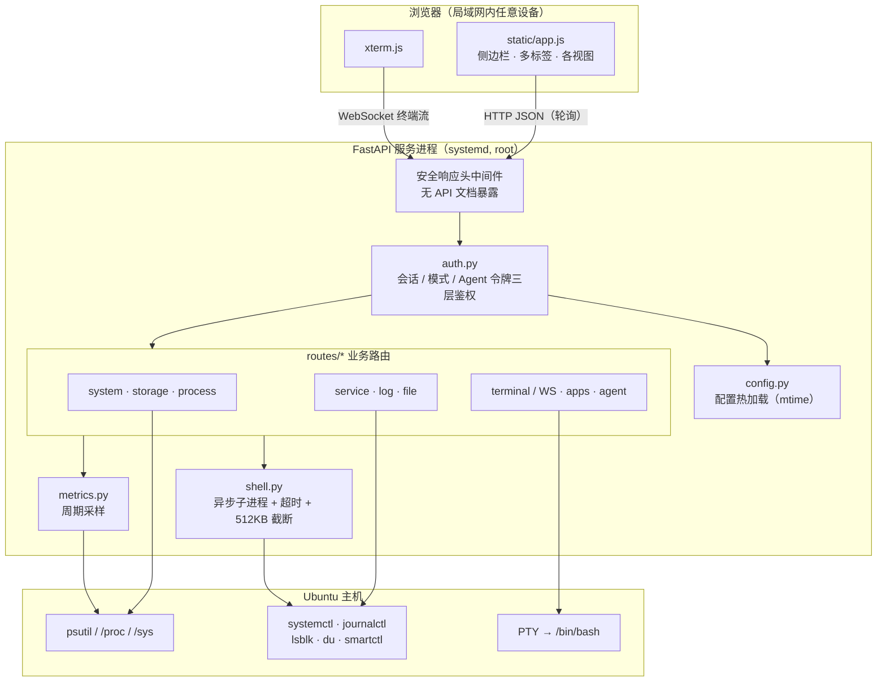

# AegisServerPanel

把一台 Ubuntu 变成可以用浏览器完全操控的服务器：默认只读监控，在服务器本机执行一条命令解锁后，就等同拿到该主机的 root shell。

- **零前端构建**：原生 JavaScript + 一个 CSS 文件，克隆即可运行
- **双模式安全模型**：公网模式只读，内网模式完全控制，模式只能在本机命令切换
- **真终端**：基于 PTY 的网页终端，不是命令回显模拟
- **Agent 接入**：一条 HTTP 请求执行一条命令，让本地脚本 / AI Agent 直接接管服务器

当前版本 `1.0.0`。

---

## 一、双模式设计

面板把「看」和「改」彻底拆成两档，默认永远停在安全的一档。

| | 公网模式（默认） | 内网模式 |
|---|---|---|
| 切换方式 | —— | **只能在服务器本机**执行 `serverpanel --enable-internal` |
| 界面入口 | 无任何切换按钮 | 无任何切换按钮 |
| 概览 / 性能监控 / 日志 | ✅ 只读 | ✅ |
| 存储 / 进程 / 服务 列表 | ✅ 只读 | ✅ |
| 网页终端 | ❌ | ✅ 完整 root shell |
| 文件读写 / 上传下载 | ❌ | ✅ |
| 进程发信号 / 调优先级 | ❌ | ✅ |
| 服务启停 / 开机自启 | ❌ | ✅ |
| 挂载 / 卸载 | ❌ | ✅ |
| 重启 / 关机 | ❌ | ✅ |
| 应用与端口发现 | ❌ | ✅ |
| Agent 接入（远程执行命令） | ❌ | ✅ |

设计要点：

1. **模式只由服务器端命令决定**。面板自身不暴露任何切模式接口，即使页面被攻破也无法自行提权。
2. **配置热加载**。模式写在配置文件里，服务进程按文件 mtime 自动重载，切换无需重启服务、无需刷新页面；前端通过指标轮询感知变化后自动重排界面。
3. **降级即断连**。从内网切回公网时，正在运行的网页终端会被服务端主动终止，Agent 令牌立即失效，受限于内网模式的标签页自动关闭。

---

## 二、功能

### 概览
系统静态信息（发行版 / 内核 / 架构 / CPU 型号与核心数 / 内存与 Swap 总量 / 运行时长）、实时资源卡片、监听地址、当前模式与权限提示。

### 性能监控
CPU 总体与单核占用、频率、负载（1/5/15 分钟）、内存与 Swap、磁盘读写速率与根分区占用、网络收发速率、CPU 温度、进程与线程数，并绘制一段滚动历史曲线。

### 网页终端
服务端分配真实 PTY，前端用 xterm.js 渲染，支持窗口自适应（fit）、窗口尺寸同步（`TIOCSWINSZ`）、清屏与断线重连，等价于直接 SSH 到服务器。仅在中断开内网模式时会被强制终止。

### 控制台 / 日志
`journalctl` 日志（可按单元、优先级、行数过滤）、`dmesg` 内核环形缓冲、`/var/log` 下文本日志文件的列举与跟随查看。

### 存储空间
块设备与分区列表（`lsblk`）、挂载点与容量占用、目录体积统计（`du`）、S.M.A.R.T. 健康信息（`smartctl`，本机安装时可用）、挂载与卸载。

### 进程管理
进程列表（按 CPU / 内存 / PID 排序）、单个进程详情与环境、发送信号（TERM / KILL / HUP / USR1…）、调整 nice 值。

### 服务管理
systemd 服务列表与状态、启停 / 重启 / 重载、开机自启开关、mask / unmask、按单元查看日志。

### 应用与端口
扫描本机所有 TCP 监听端口，按**进程**聚合，回答「这台机器上跑了几个应用、分别监听哪个 IP 和端口」：

- 列出应用名、PID、运行用户、内存占用、命令行
- 每个监听端口给出**可直接点击的访问链接**
- 监听 `0.0.0.0` / `::` 时自动替换为服务器的局域网 IP，避免给出点不开的地址
- 监听 `127.0.0.1` 的标记「仅本机」，不生成无效链接
- 数据库 / Redis / Kafka / VNC 等端口识别为「非 Web 服务」，不生成误导链接
- `443` / `8443` 等端口自动使用 `https://`

### 文件管理
目录浏览、在线查看与编辑（2 MB 上限）、新建 / 重命名 / 复制 / 删除、下载与上传、按名称搜索、分区占用概览。`/`、`/etc`、`/usr`、`/boot` 等系统关键目录被列入保护名单，禁止删除。

### Agent 接入
给本地脚本和 AI Agent 用的入口。详见下文「Agent 接入」。

### 设置
修改面板密码、查看当前模式、Agent 令牌状态与运行环境信息。

---

## 三、架构

### 技术栈

| 层 | 选型 | 说明 |
|---|---|---|
| Web 框架 | FastAPI + Uvicorn | 原生支持 WebSocket 与异步子进程 |
| 系统采集 | psutil | CPU / 内存 / 磁盘 / 网络 / 进程 / 连接 |
| 系统操作 | subprocess（异步） | 统一封装 `systemctl` / `journalctl` / `lsblk` / `du` 等 |
| 终端 | pty + xterm.js | 服务端伪终端，前端渲染 |
| 前端 | 原生 JS / CSS | 无构建步骤，无框架，无 npm |
| 部署 | systemd | 以 root 运行，开机自启 |

### 目录结构

```
AegisServerPanel/
├── app/
│   ├── main.py               # 应用入口、路由挂载、安全响应头、CLI 与启动横幅
│   ├── config.py             # 配置持久化、密码哈希、运行模式、Agent 令牌
│   ├── auth.py               # 会话管理、各类鉴权依赖（含 WebSocket）
│   ├── metrics.py            # 性能采样器（2s 一次，保留 120 点历史）
│   ├── shell.py              # 命令执行封装：超时保护 + 输出截断
│   └── routes/
│       ├── auth_routes.py    # 初始化 / 登录 / 登出 / 改密
│       ├── system_routes.py  # 系统信息、指标、历史、网络、能力探测、电源
│       ├── storage_routes.py # 磁盘、挂载、目录体积、S.M.A.R.T.
│       ├── process_routes.py # 进程列表、详情、信号、nice
│       ├── service_routes.py # systemd 服务管理
│       ├── log_routes.py     # journal / dmesg / 日志文件
│       ├── file_routes.py    # 文件浏览、读写、上传下载、搜索
│       ├── terminal_routes.py# PTY WebSocket 终端 + 一次性命令执行
│       ├── app_routes.py     # 应用与端口发现
│       └── agent_routes.py   # Agent 令牌管理、接入信息、执行审计
├── static/
│   ├── index.html            # 单页骨架（登录页 + 主界面）
│   ├── app.js                # 全部前端逻辑：路由、视图、多标签、终端、模式适配
│   ├── style.css             # 全站样式
│   └── vendor/               # xterm.js 与 fit 插件（本地内置，不依赖 CDN）
├── install.sh                # systemd 安装脚本
├── run.sh                    # 前台快速启动（调试用）
└── requirements.txt
```

### 分层与请求链路



一次典型请求：浏览器带 `sp_session` Cookie 发起 HTTP 请求 → 中间件补安全响应头 → 路由级依赖做鉴权 → 业务逻辑通过 `psutil` 或 `shell.run()` 取数据 → 返回 JSON。敏感路由在鉴权依赖里额外校验当前模式。

### 权限模型（三层）

1. **身份层**：`require_auth` —— 校验会话 Cookie。密码用 PBKDF2-HMAC-SHA256（260,000 轮 + 16 字节随机盐）存储，会话有效期 12 小时，Cookie 为 HttpOnly。
2. **模式层**：`require_internal` —— 在身份层之上要求当前处于内网模式，否则 403。所有写操作与敏感读操作都挂在它下面。
3. **令牌层**：`require_exec_auth` —— 供命令执行接口使用，接受「面板会话」或「Agent 令牌」两种身份，且同样要求内网模式；令牌比对用 `hmac.compare_digest` 防时序侧信道。

前端还有一道**展示层过滤**：内网专属视图在公网模式下不出现在导航里，手动改 URL 也会被路由守卫弹回概览。这只是体验层，真正的拦截在服务端。

### 实时数据通道

| 场景 | 通道 | 说明 |
|---|---|---|
| 性能指标 | HTTP 轮询 | 前端定时拉取 `/api/system/metrics`；每次轮询顺带同步当前模式，实现模式切换的界面自适应 |
| 网页终端 | WebSocket | 双向二进制流，PTY 到浏览器直连；另有协程监视模式变化，一旦降级立即终止会话 |
| 日志跟随 | HTTP 轮询 | 按 tail 行数拉取增量 |

采样器由 FastAPI lifespan 启动，每 2 秒采集一次并写入 120 点的环形缓冲，新打开页面时可直接回填历史曲线。

---

## 四、安装与运行

```bash
git clone https://github.com/DataBaseC/AegisServerPanel.git
cd AegisServerPanel
sudo bash install.sh
```

安装脚本会：创建 `.venv` 并装依赖 → 生成 `/usr/local/bin/serverpanel` → 写入并启动 `serverpanel.service`（User=root，开机自启，默认监听 `0.0.0.0:8787`）→ 打印所有可访问地址。

自定义监听：

```bash
sudo SERVERPANEL_HOST=0.0.0.0 SERVERPANEL_PORT=9000 bash install.sh
```

不用 systemd、只想前台调试：

```bash
./run.sh --port 8787
```

安装后打开 `http://<服务器IP>:8787`，首次访问会引导设置面板密码。

常用运维命令：

```bash
systemctl status serverpanel      # 查看状态
systemctl restart serverpanel     # 重启
journalctl -u serverpanel -f      # 查看面板日志
```

---

## 五、模式与令牌管理命令

全部命令都打印结果后立即退出，可安全地在服务器本机执行。

```bash
serverpanel --show-mode             # 查看当前模式
serverpanel --enable-internal       # 激活内网模式（完全控制）
serverpanel --disable-internal      # 关闭内网模式（回到只读）

serverpanel --set-password 新密码    # 重置面板密码（忘记密码时用）

serverpanel --agent-token           # 生成 / 轮换 Agent 令牌
serverpanel --show-agent-token      # 查看当前 Agent 令牌
serverpanel --revoke-agent-token    # 吊销 Agent 令牌
```

---

## 六、Agent 接入

让本地脚本或 AI Agent 像登录服务器一样执行命令，不需要维持交互式会话。

**准备**（内网模式下）：

```bash
serverpanel --enable-internal
serverpanel --agent-token      # 复制输出的令牌
```

**调用契约**

```
POST /api/terminal/exec
X-Agent-Token: <令牌>            # 也支持 Authorization: Bearer <令牌> 或 ?token=<令牌>
Content-Type: application/json

{"command": "systemctl restart nginx", "cwd": "/opt", "timeout": 60}

→ {"code": 0, "stdout": "...", "stderr": "..."}
```

`command` 必填，`timeout` 取值 1~600 秒（默认 60），`code` 为命令退出码。

**示例**

```bash
# curl
curl -sS -X POST 'http://192.168.1.10:8787/api/terminal/exec' \
  -H 'X-Agent-Token: <令牌>' -H 'Content-Type: application/json' \
  -d '{"command":"uname -a && df -h"}'

# bash：包装成命令行工具，像 SSH 一样用（需要 jq）
export SP_URL='http://192.168.1.10:8787/api/terminal/exec'
export SP_TOKEN='<令牌>'
sp() {
  jq -n --arg c "$*" '{command:$c, timeout:600}' \
    | curl -sS -X POST "$SP_URL" -H "X-Agent-Token: $SP_TOKEN" \
        -H 'Content-Type: application/json' --data @- \
    | jq -r '.stdout, .stderr'
}
sp systemctl status nginx
```

**安全约束**

- 令牌仅在内网模式下有效：一旦 `--disable-internal`，所有 Agent 请求立即 403
- 令牌保存在 0600 权限的配置文件中，支持随时轮换与吊销；轮换后旧令牌立即失效
- 所有经由此接口执行的命令都会记入审计（来源标记为 Agent、来源 IP、命令、退出码、耗时），可在「Agent 接入」页面查看

---

## 七、HTTP 接口一览

除 `/`, `/healthz`, `/static/*` 外，全部接口在 `/api` 下，默认要求登录。标记 🔒 的接口额外要求内网模式。

| 模块 | 接口 | 说明 |
|---|---|---|
| 认证 | `GET /api/auth/status`、`POST /api/auth/setup`、`POST /api/auth/login`、`POST /api/auth/logout`、`POST /api/auth/password` | 会话与密码 |
| 系统 | `GET /api/system/info`、`/metrics`、`/history`、`/processes`、`/network`、`/capabilities` | 信息、指标、能力探测 |
| 系统 | `POST /api/system/power` 🔒 | 重启 / 关机（需 `confirm=CONFIRM`） |
| 存储 | `GET /api/storage/overview`、`/dirsize`、`/mounts`、`/smart` | 磁盘与挂载信息 |
| 存储 | `POST /api/storage/mount`、`/unmount` 🔒 | 挂载管理 |
| 进程 | `GET /api/processes`、`GET /api/processes/{pid}` | 列表与详情 |
| 进程 | `POST /api/processes/{pid}/signal`、`/nice` 🔒 | 信号与优先级 |
| 服务 | `GET /api/services`、`/{name}`、`/{name}/logs` | 服务列表、详情、日志 |
| 服务 | `POST /api/services/{name}/action` 🔒 | 启停 / 自启 / mask |
| 日志 | `GET /api/logs/sources`、`/journal`、`/dmesg`、`/tail`、`/file` | 日志读取 |
| 文件 | `GET /api/files/roots`、`/list`、`/stat`、`/read`、`/download`、`/search`、`/usage` 🔒 | 浏览、读取、下载 |
| 文件 | `POST /api/files/write`、`/mkdir`、`/rename`、`/copy`、`/delete`、`/upload` 🔒 | 写入与变更 |
| 终端 | `GET /api/terminal/info` 🔒 | 终端与运行环境信息 |
| 终端 | `POST /api/terminal/exec` 🔒 | 一次性命令执行（面板会话或 Agent 令牌） |
| 终端 | `WS /api/terminal/ws` 🔒 | 交互式 PTY 终端 |
| 应用 | `GET /api/apps` 🔒 | 监听端口 → 应用与访问链接 |
| Agent | `GET /api/agent/info` 🔒 | 令牌状态、接入信息、执行审计 |
| Agent | `POST /api/agent/token`、`DELETE /api/agent/token` 🔒 | 生成 / 轮换、吊销令牌 |

---

## 八、配置与数据

- 配置文件：root 运行时为 `/etc/serverpanel/config.json`，普通用户为 `~/.config/serverpanel/config.json`，权限固定 `0600`
- 可用 `SERVERPANEL_CONFIG` 环境变量或 `--config` 指定路径
- 内容包含：密码哈希与盐、会话签名密钥、当前模式与切换时间、Agent 令牌

启用 HTTPS（自行准备证书）：

```bash
serverpanel --host 0.0.0.0 --port 8787 --ssl-certfile /path/cert.pem --ssl-keyfile /path/key.pem
```

---

## 九、安全说明

这个面板等价于把 root shell 挂到网络上，请务必只在可信网络中使用。

- **不要暴露到公网**。默认监听 `0.0.0.0:8787` 且使用 HTTP；如需外网访问，请放在反向代理 + HTTPS + 鉴权之后
- **限制来源**，例如只放行内网网段：
  ```bash
  ufw allow from 192.168.0.0/16 to any port 8787 proto tcp
  ```
- **用完就关**：内网模式是临时授权，操作完执行 `serverpanel --disable-internal`
- **妥善保管 Agent 令牌**，不要提交进版本库或粘贴到公开场合；怀疑泄露立即 `--agent-token` 轮换
- 已内置的防护：无 API 文档暴露、`nosniff` / `DENY` / `no-referrer` 安全响应头、接口响应 `no-store`、系统关键目录删除保护、命令执行超时与输出截断

---

## 十、已知限制

- 面向 Ubuntu / Debian 系，依赖 systemd；容器内（无 systemd 作为 PID 1）时服务、电源、journal 相关功能会自动置灰
- 服务、电源、S.M.A.R.T.、`dmesg` 等功能需要 root 权限，非 root 运行时部分能力不可用
- 「应用与端口」只覆盖 TCP 监听端口，UDP 服务不列出
- 端口是否为 Web 服务使用内置端口表判断，非常规端口可能误判（仍会给出链接，可自行验证）
- 未做多用户与权限分级，所有登录者共享同一个面板密码与 root 权限
